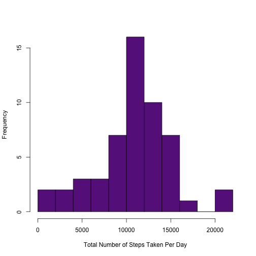
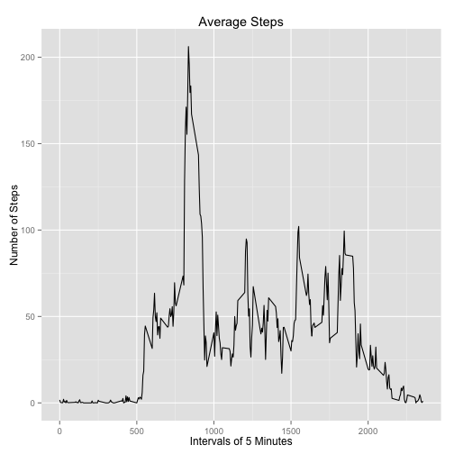
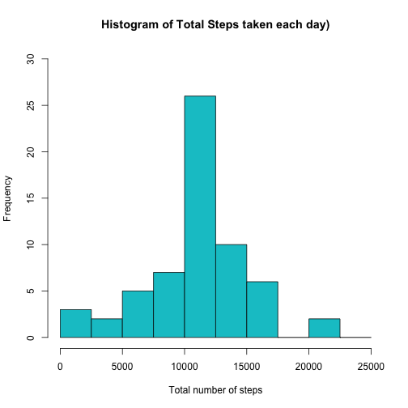
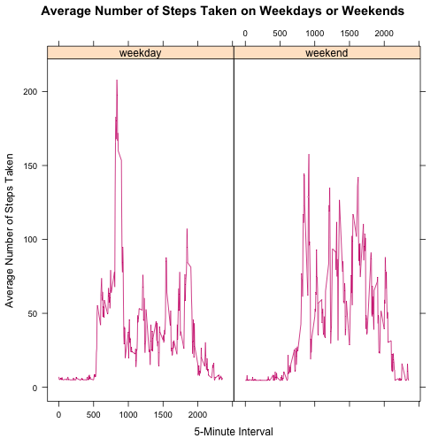

##Reproducible Research
##Peer Assessment 1
#####Author: Nishay Naser Pasha
  
    
    
####Introduction to Peer Assessment 1
  
This is Peer Assessment 1 of the course Reproducible Research. The objective of this assignment is to create an R Markdown file that results is the report of some basic data analysis.  

The dataset used for this assignment is Activity Monitoring Data which includes the following fields:

* steps: number of steps taken in 5 minutes
* date: date of records taken
* interval: interval identifier
  
####Loading the Data
  
Given below is the code for loading the data to begin the assignment.

```r
data <- read.table("activity.csv", header = TRUE, sep = ",")
```
  
####Pre-Processing the Data
  
Given below is the code to pre-process the data to make it more suitable for use.

```r
data$date <- as.Date(data$date)
```
  
####Mean Total Number of Steps Taken per Day
  
Given below is the code to calculate the total number of steps taken per day and to plot a histogram. The mean and median are also calculated below.

```r
noMissingData <- na.omit(data)        #removing missing values
stepsPerDay <- rowsum(noMissingData$steps,      #calculating steps per day
                      format(noMissingData$date, '%Y%m%d'))          
stepsPerDay <- data.frame(stepsPerDay)
names(stepsPerDay) <- ("steps")
hist(stepsPerDay$steps,             #plotting the histogram
     main = " ",
     breaks = 10,
     col = "darkorchid4",
     xlab = "Total Number of Steps Taken Per Day")
```

 

```r
mean(stepsPerDay$steps);
```

```
## [1] 10766.19
```

```r
median(stepsPerDay$steps);
```

```
## [1] 10765
```
  
####Average Daily Activity Pattern
  
Given below is the code to plot an average, daily pattern.

```r
library(plyr)
intervalSteps <- ddply(noMissingData, ~interval,       #calculating avg steps
                       summarise, mean=mean(steps))
```

```r
library(ggplot2)
qplot(x=interval, 
      y=mean, 
      data = intervalSteps, 
      geom = "line",
      main = "Average Steps",
      xlab = "Intervals of 5 Minutes",
      ylab = "Number of Steps"
)
```

 

```r
intervalSteps[which.max(intervalSteps$mean), ]
```

```
##     interval     mean
## 104      835 206.1698
```
  
####Imputing Missing Values
  
Given below is the code to calculate the number of missing values

```r
missingCount <- sum(is.na(data$steps))     #calculating no. of missing values
```

```r
missingValues <- which(is.na(data$steps))         #locating missing values
meanValues <- rep(mean(data$steps, na.rm=TRUE), times=length(missingValues))
data[missingValues, "steps"] <- meanValues
sum_data <- aggregate(data$steps, by=list(data$date), FUN=sum)
names(sum_data) <- c("date", "total")        #renaming
hist(sum_data$total, 
     breaks=seq(from=0, to=25000, by=2500),
     col="turquoise3", 
     xlab="Total number of steps", 
     ylim=c(0, 30), 
     main="Histogram of Total Steps taken each day)")
```

 

```r
mean(sum_data$total)
```

```
## [1] 10766.19
```

```r
median(sum_data$total)
```

```
## [1] 10766.19
```
  
####Difference in Activity Patterns between Weekdays & Weekends
  

```r
library(sqldf)
```

```
## Warning in doTryCatch(return(expr), name, parentenv, handler): unable to load shared object '/Library/Frameworks/R.framework/Resources/modules//R_X11.so':
##   dlopen(/Library/Frameworks/R.framework/Resources/modules//R_X11.so, 6): Library not loaded: /opt/X11/lib/libSM.6.dylib
##   Referenced from: /Library/Frameworks/R.framework/Resources/modules//R_X11.so
##   Reason: image not found
```

```r
data$week <- as.factor(ifelse(weekdays(data$date) %in% 
                c("Saturday","Sunday"),"weekend", "weekday"))
newData <- sqldf('   
    SELECT interval, avg(steps) as "mean.steps", week
    FROM data
    GROUP BY week, interval
    ORDER BY interval ')
```

```r
library("lattice")
p <- xyplot(mean.steps ~ interval | factor(week), data=newData, 
       type = 'l',
       col="deeppink3",
       main="Average Number of Steps Taken on Weekdays or Weekends",
       xlab="5-Minute Interval",
       ylab="Average Number of Steps Taken")
print (p)
```

 
